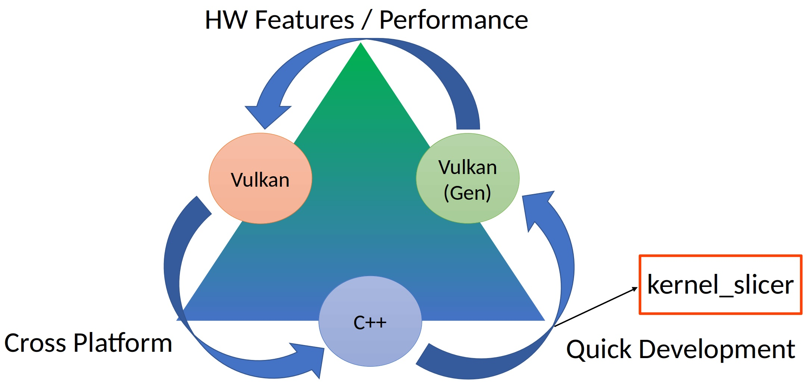
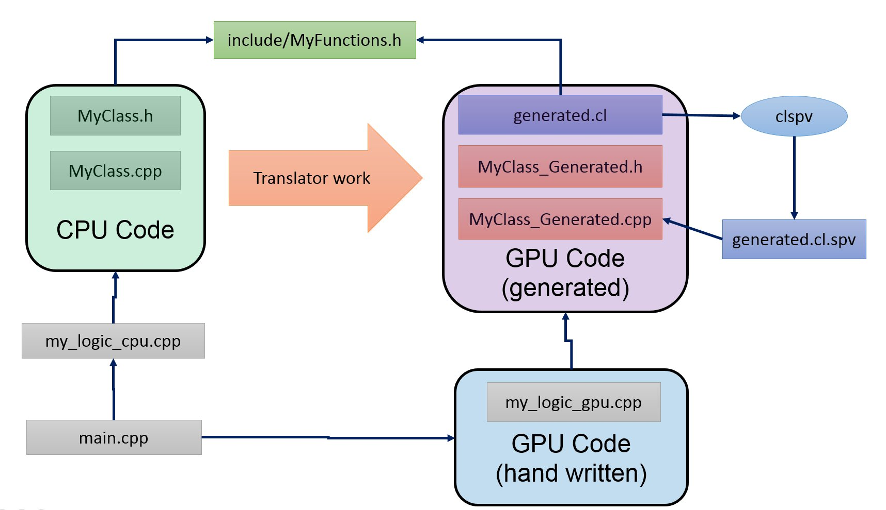

# kernel_slicer: CPU to GPU (Vulkan) translator

<hr>
This project is carried out at the Institute of Applied Mathematics Russian Academy of Science (KIAM RAS) and supported by the Russian Science Foundation (RSF) under grant #21-71-00037.
<hr>

<p align = "center"></p>
<p align = "center">Fig. 1. Our translator has many heads due to many existing programming patterns.</p><BR>
This project is based on clang (fig. 1.). We sincerely thank the clang front-end developers for the great structure and documentation of their project!
We heavily used clang front-end infrastructure to transform input C++ source code and generate GPU implementation of the algorithm in Vulkan. 


# Project goal

The goal of this project is to increase developer productivity when porting CPU code to Vulkan which is time consuming work in general.
This means cross platform for C++ developers providing them at the same time ability to use any existing and any perspective HW featues of GPUs.
We did this by accelerating/simplifying software development in Vulkan. Our conept is to provide quick transition from HW-agnostic C++ to GPU version of the same algorithm which can be automated for more than 90% (Fig. 2). The remaining 10% are written by hand and can use any desire HW extensions which, for example, are not supported by the kernel_slicer yet.

<p align = "center"></p>
<p align = "center">Fig. 2. Purpose and place of our tool among other GPU programming technologies.</p><BR>

Vulkan is great! But it is time consuming technology, which mean significant increase for cost and time of software developemnt. Our goal is to create complex algorithms in Vulkan fast. And our goal is to preserve 100% cross-platform ability be keeping the input source code in form of common C++ without **any** language extensions.

# Project overview

kernel_slicer is prototype auto-programming tool which takes C++ code as input and port this code to GPU by generating optimized Vulkan implemantation automaticly using source-to-source transtation and domain specific knowlege. Please read several short remarks about our project.

* We generate C++ source code in Vulkan. We don't (and don't plan currently) to support any other back-ends (like CUDA or OpenCL) since we see no need for this. Nevertheless, if you see such a need for your project and you like our concept, please contact us;

* Our goal is to generate code as if it were written by hand, but we automate 90% mechanical work which developers have to do when using Vulkan. We don't introduce any ineffitiency in the generated code and generate readable and understandable code. It is assumed that you will use generated code as normal;

* kernel_slicer is NOT a general-purpose programming technology (well, general purpose programming is still possible with it). We use pattern matching to efficiently map certain types of software to GPU. Such types are called patterns;

* Patterns are specific cases of algorithms/software which has known efficient implemantation for GPUs. Because we have additional knowllege about algorithm during translation, we can embede specific optimisation to our translator and leave program logic code clean of these optimisations; 

* Currently we support 2 architectural patterns: Image Processing Vectorization (IPV) and Ray Tracing Vectorization (RTV). Architectural pattern is a template/pattern which tells compiler how you software looks in general, ath the high level. We recommend you to start with IPV because it is straitforward pattern for extraction of "parallel for"; The RTV pattern is differs and assume that in normal CPU code parallel for loops are placed out of both kernels and control functions;

* Inside architectural patterns more granularly algorithmic pattern can occur. Currently we support several of them: parallel reduction, indirect dispatching, parallel buffer append, texture read/write/sample, virtual function call (this last one is in prototype stage). 

* Our tool is not classic compiler. It generate  GLSL kernels or kernel source code for [google clspv](https://github.com/google/clspv "Clspv is a prototype compiler for a subset of OpenCL C to Vulkan compute shaders") and then henerates C++ code for Vulkan calls to run kernels correcly. 

* Let's summarize again: you have to bind generated code to your program yourself, thus you can't  escape Vulkan experience. You can directly use generated class. You can also override some functions if you want to change behaviour of some parts of generated code (see [Example of glue code](doc/README_glue.md));

* Our main users are Vulkan developers that has to use Vulkan due to some specific hardware features or performance requirenments. Therefore, we initially pay special attention to interaction between generated and hand written code (which can use any desired hardware extensions). Such interaction is assumed to be done via inheritance and virtual function overides (see [Example of glue code](doc/README_glue.md));

# Build:

1. git clone https://github.com/Ray-Tracing-Systems/kernel_slicer

2. Download dependencies 
 * cd kernel_slicer
 * bash fetch_sources.bat 

3. sudo apt-get install llvm-12-dev

4. sudo touch /usr/lib/llvm-12/bin/yaml-bench 

5. sudo apt-get install libclang-12-dev 

6. use Cmake and make

  * cd kernel_slicer
  * cmake . 
  * make -j 10

7. you may also use provided VS Code config to build and run test cases (tasks.json and launch.json)

8. Install Vulkan SDK (https://vulkan.lunarg.com/sdk/home)

9. (optional) build [google clspv](https://github.com/google/clspv "Clspv is a prototype compiler for a subset of OpenCL C to Vulkan compute shaders") if you want OpenCL shaders

10. (optional) If you want to [build it as a part of llvm](doc/README_build_with_llvm.md)

# Concept and general workflow

Now let us discuss general workflow of using kernel_slicer to port you code to GPU (Fig. 3):

<p align = "center"></p>
<p align = "center">Fig. 3. Sceme of our translator usage. We can generated both GLSL shaders (for different GLSL compilers) and OpenCL shaders for clspv</p><BR>

* To the first, suppose your logic on the CPU is implemented in some class (called *MyClass*) inside *MyClass.h* and *MyClass.cpp* files; 

* And suppose that you class *MyClass.h* is used by another file *my_logic_cpu.cpp* which is normal C++ code;

* Now we know that our logic is implemented inside some *MyClass* methods and we also know that *MyClass* is implemented according to some programming pattern supported by kernel_slicer. Not OOP patterns, like in [Gang of Four](https://en.wikipedia.org/wiki/Design_Patterns) book, but some high level domain specific pattern for concrete set of applications or algorithms. Like ray tracing, image processing, [CFD](https://en.wikipedia.org/wiki/Computational_fluid_dynamics) or other.

* You give *MyClass.cpp* to the translator, tell it pattern name, and then got your optimized GPU implementation in Vulkan to be generated in three files: *MyClass_Generated.h*, *MyClass_Generated.cpp* and *z_generated.cl*.

  * MyClass_Generated.h represent Vulkan interface to the generated class;

  * MyClass_Generated.cpp contain generated Vulkan calls (and in fact can be split to multiple files because Vulkan despriptor set initialization code is quite huge);

  * generated.cl ('z_generated.cl' for clspv or GLSL shaders in 'shaders_generated' directory) contain generated kernels;
  
* The generated C++ implementation in *MyClass_Generated.cpp* assume that you will compile *z_generated.cl* manually with [google clspv](https://github.com/google/clspv "Clspv is a prototype compiler for a subset of OpenCL C to Vulkan compute shaders") to get *z_generated.cl.spv* (or compiled GLSL shaders in folder 'shaders_generated');

* Now you should plug generated implementation in to your application by creating *my_logic_cpu.cpp* which will use interface provided by *MyClass_Generated.h*.

## runing examples

1. Clone kernel_slicer and build it;

    * git clone --recurse-submodules https://github.com/Ray-Tracing-Systems/kernel_slicer
    * cd kernel_slicer
    * cmake . 
    * make -j 10
 
2. Don't forget to build volk
    * git submodule init (if you have forgotten to fetch submodules when clone repo) 
    * git submodule update (if you have forgotten to fetch submodules when clone repo) 
    * cd apps/volk
    * cmake .
    * make

3. (optional) build clspv and put it in "apps" folder;

4. Select one of examples from app folder. We use the simple example of image processing in this tutorial: "apps/05_filter_bloom_good".

5. (optional) Understand CPU code. You may comment all Vulkan includes and generated files from CMakeLists.txt (any "*_generated.cpp" file) to build and run only cpu code. And please comment "tone_mapping_gpu()" call in main.cpp; You may fix CMake and includes back later.

6. Run kernel kslicer with the folowing command line (examples are stored in ".vscode/launch.json") from the project folder (i.e. the folder where this README.md is located): 
* if use clspv:
```
./kslicer apps/05_filter_bloom_good/test_class.cpp -mainClass ToneMapping -stdlibfolder TINYSTL -pattern ipv -reorderLoops YX -Iapps/LiteMath ignore -DKERNEL_SLICER -v
```
* if use GLSL:
```
./kslicer "apps/05_filter_bloom_good/test_class.cpp"  -mainClass ToneMapping -stdlibfolder TINYSTL -pattern ipv -reorderLoops YX -Iapps/LiteMath ignore -shaderCC GLSL -DKERNEL_SLICER -v
```
Now generated files should apper in  "apps/05_filter_bloom_good" folder.

If kslicer **can not find "stddef.h"** inside gcc folders:

  * This mean it can't find clang standart library and than start search it in system directories. You should prevent this by copying clang standart library in to appropriate folder.
  * This happends on ArchLinux and for building kslicer as a part of llvm due to different build options of llvm dev packages for different systems.
  * clang searches for "../lib/clang/12.0.0/include" (put your version of llvm), so just copy appropriate libraries in this way

```    
  cd kernel_slicer
  mkdir ../lib && cp -r /usr/lib/clang/ ../lib
```

7. Compile generated shaders.
* if use clspv: put clspv to "apps" folder and then run futher command from concrete folder sample (In VS Code config this process is called "Build Kernels"):
```
bash z_build.sh
```
  * You should obtain "z_generated.cl.spv" in "apps/05_filter_bloom_good" folder:
  * if use GLSL: go to "apps/05_filter_bloom_good/shaders_generated" and run (In VS Code config this process is called "Build Kernels (GLSL)"):
```
bash build.sh
```
  * You should obtain many different SPIR_V files in "apps/05_filter_bloom_good/shaders_generated"
  * Sometimes kslicer can't create 'include' directory inside sample folder. Create it please and than run kslicer again.
 
8. Now you can bind generated code to some your Vulkan code. We provide simple example in *test_class_gpu.cpp*.

9. Build and run application (don't forget to get back "tone_mapping_gpu()" call in main.cpp if you previously comment it) from the sample folder "apps/05_filter_bloom_good". Now you should have 2 identical images in the sample forder: the first from the CPU code path and the second from the GPU one.  

  * cd apps/05_filter_bloom_good
  * cmake -DCMAKE_BUILD_TYPE=Release .
  * make -j 8
  * ./testapp

## Feature list: what you can do and what you should avoid

(+) can declare structs and constants (via constexpr) in class;

(+) can access POD-like class data members inside kernels;

(+) can access class data members of std::vector type inside kernels;

(+) can use vector.size(), vector.capacity(), vector.data() inside kernels;

(+) can pass vector.data() to kernel in control function;

```cpp
void TestClass::CastSingleRay(uint tid, uint* in_pakedXY, uint* out_color)
{
  ... 
  Lite_Hit hit; 
  kernel_GetMaterialColor(tid, &hit, spheresMaterials.data(), // ok, this is valid
                          out_color);
}
```

(+) can use vector.push_back() inside kernels;

(+) can use memcpy in control functions for IPV pattern;

(-) can't **yet** use nested vector types. I.e. if std::vector is inside some structure which is stored in std::vector in main class (**not implemented**);

So, here some examples about class-members access:

```cpp
struct MyTestStruct
{
  float myData[4];
};

struct MyNestedTestStruct
{
  float myData[4];
  std::vector<float> nestedData;
};

class TestClass // main class
{
  float4x4 m_worldViewProjInv;                        // ok
  unsigned int m_data1;                               // ok
  float m_data2[3];                                   // ok
  std::vector<unsigned int>        m_someBufferData1; // ok
  std::vector<MyTestStruct>        m_someBufferData2; // also ok
  MyNestedTestStruct               m_someBufferData3; // ILLEGAL! NOT YET SUPPORTED!
  std::vector<MyNestedTestStruct>  m_someBufferData4; // ILLEGAL! NOT YET SUPPORTED!
};
```

(+) (GLSL only) can use class methods inside kernels 

(+) (GLGL only) can use textures (see 14 and 15 samples);

(+) can and should use pointers for arguments of "kernel" and "control" functions (see further what are "kernel" and "control");

(+) (better with clspv) can pass pointers from kernel argument or member vector.data() to functions. For GLSL case we have very restricted support for these type of pointers currently;

(+) (clspv only) can call virtual kernels (**see samples 10, 12 and 14 in 'apps'**);

(-) can't **yet** inherit your class from some other class (**not implemented**);

(-) can't use pointer members inside kernels (**not implemented yet**). The translator will ignore pointer members because it can't know size of your data which is mandatory. However we will could transform each such pointer to VkBuffer in future. But this means in generated code you should set those buffers yourself.

(-) can't print to std output or files inside kernels (**not planned for implementation**). Although this functionality can be implemented, we see no critical need in it because it is supposed that you will debug your code on the CPU and then just comment out all file/streams output inside kernel code;

## if it does not work

The kernel_slicer does pretty simple and stupid work. Therefore, not much things can go wrong:

0. Sometimes kslicer can't create 'include' directory inside sample folder. Create it please and than run kslicer again.
 
1. If you got error message from *kslicer* application on the translation stage please read and understand it. Currently, the most common problem on this stage is absence of some functions from the STL. Just define these functions in *TINYSTL* directory. Note that you don't have to implement them, just define required interface to clang AST parser got them!

2. If your generated code can not be not compiled, seems you dont follow the pattern or there is some-thing which is not supported by our translator yet;

3. If you don't see some functions in generated code which are supposed to be there, you don't follow the pattern and kernel_slicer just ignore such code;

4. If you have some error messages from clspv, analyze them and understand what happened; Since our technology uses clspv, you have to follow its restrictions: add "__global" qualificator to pointers which assumed to access GPU global memory, don't compare/check pointers to zero, and other.   

5. If you use GLSL and have some error messages from GLSL compiler, just play around with your code, split complex expressions to several lines for example. Usually it is easy to make generated GLSL works withing сosmetic changes for input code. Well, currently there are several complex cases for "C++ to GLSL" translator wich didn't yet implemented properly. We are working on that.  

Anyway you are welcome to report bugs.

# Patterns

## Image Processing Vectorization (IPV) Pattern

We begin with the simplest pattern which we call "Image Processing Vectorization (IPV) Pattern". In fact, this pattern **implements standart parallel for** which is common for any GPU programming technology. Therefore, we recommend that you start your acquaintance with our technology from the Image Processing examples. Please note that this pattern is quite general and can be used for many different aplications other than Image Processing. 


* [Example #5: Bloom filter](doc/README_ex05.md)

## Ray Tracing Vectorization (RTV) Pattern

In practical applications of Ray Tracing there is a problem with effitiency of complex code: if fact you can't just put all your code for ray/path evaluation to a single kernel if you take care about performance. So, developers usually split their implementation in multiple kernels and pass some data (*which is called payload in RTX*) between kernels via main memory and may use some optimizations like thread compaction or path regeneration or RTX pipileine in Vulkan. In the same time, kernels need to access arbitrary data of materials, light and geometry. Therefore, in our opinion RTV patterns is quite general vectorization pattern which can be used for many different applications other than ray tracing. 

* [Example #1: single kernel ](doc/README_ex00.md)

* [Example #2: passing data between kernels](doc/README_ex01.md)

* [Example #3: path tracing with loop-break](doc/README_ex03.md)

* [Example #4: virtual kernel call (WORK IN PROGRESS!)](doc/README_ex04.md)

## Internal documentaion

The documentation for general concepts of how it works is located [here](doc/README_internal.md)

# Acknowlegments
This project is supported by the Russian Science Foundation (RSF) under grant #21-71-00037.
 
