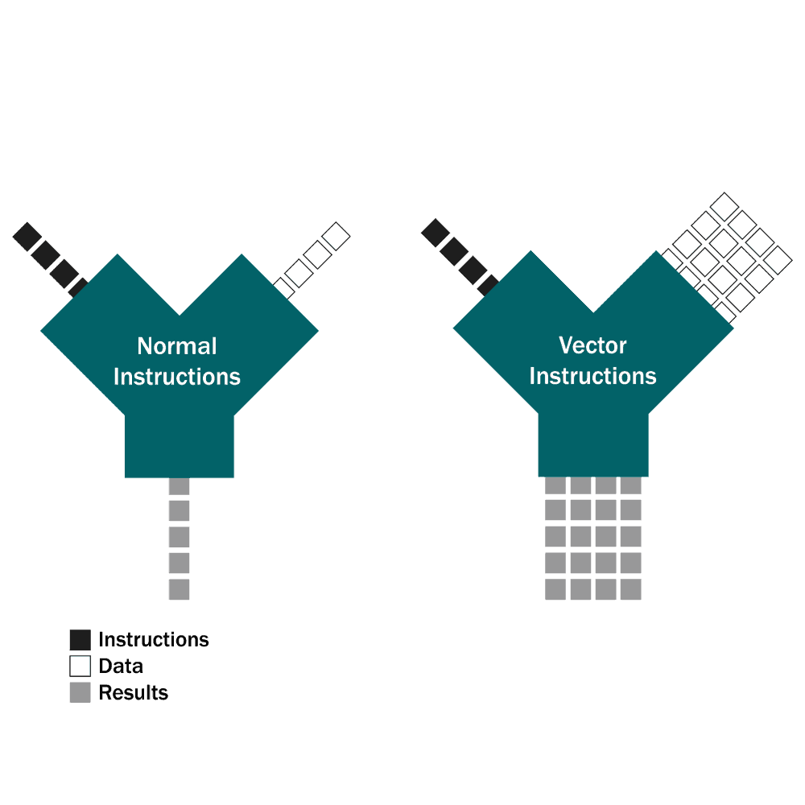

# Example #2: passing data between kernels

The kernel_slicer can be thought of a sort of high level vectorization technology (fig. 2) which uses Vulkan as a core back-end for actual code vectorization. In fact we have many existing vectorization technologies like CUDA, OpenCL, ISPC, Vulkan and some other like [enoki](https://github.com/mitsuba-renderer/enoki "structured vectorization and differentiation on modern processor architectures"), TBD add more ...

<p align = "center"></p><p align = "center">Fig. 2. Code vectorization technology idea</p><BR>

When you are exploring different ways of splitting your code into pieces to better optimize those pieces with a vectorizing compiler, you have to try many different variants which is time consuming with Vulkan and make optimization process hard.

To adress this issue within RTV pattern you may just write scalar code inside control functions (and inside kernels also!) and declare variables which will be vectorized automaticly in generated code. When you declare scalar variable inside control function the translator will generate separate buffer for store intermediate data which you use to pass data between kernels.

```cpp
float  data1; ------> float data1_V[N];
float4 data4; ------> float data4_V[N];
```

Or in Vulkan:
```cpp
float  data1; ------> VkBuffer data1Buffer;
float4 data4; ------> VkBuffer data4Buffer;
```

So, consider further control function:

```cpp
void TestClass::MainFunc(uint tidX, uint tidY, uint* out_color)
{
  float4 rayPosAndNear, rayDirAndFar;
  kernel_InitEyeRay(tidX, tidY, 
                    &rayPosAndNear, &rayDirAndFar); // ==> (rayPosAndNear, rayDirAndFar)

  Lite_Hit hit;
  kernel_RayTrace(tidX, tidY, &rayPosAndNear, &rayDirAndFar, 
                  &hit); // (rayPosAndNear, rayDirAndFar) ==> hit
  
  kernel_TestColor(tidX, tidY, &hit, 
                   out_color);  // hit ==> out_color
}
```

Here we have four local variables which will be translated to buffers and three kernel functions which will be translated to kernels. It is developer responsibility to define how to split code to kernels, but in general this is should be consistenmt with program logic in normal CPU code.

You can think of the local variables of the control function variables as being on the stack (well, which in general is true for CPU code). And think about the code that is implemented inside the kernels --- as about the code that uses exclusively registers and stores the result on the stack in these variables.

Now let us see input and generated source code for kernel_InitEyeRay:
```cpp
void TestClass::kernel_InitEyeRay(uint tid, float4* rayPosAndNear, float4* rayDirAndFar)
{
  const float3 rayDir = EyeRayDir(tid, /* ... */, m_worldViewProjInv); 
  const float3 rayPos = make_float3(0.0f, 0.0f, 0.0f);
  
  *rayPosAndNear = to_float4(rayPos, 0.0f);
  *rayDirAndFar  = to_float4(rayDir, MAXFLOAT);
}
```
And the generated kernel:

```cpp
__kernel void kernel_InitEyeRay(
  __global float4 * restrict rayPosAndNear,
  __global float4 * restrict rayDirAndFar,
  __global const uint* restrict kgen_data,
  const uint kgen_iNumElementsX,
  const uint kgen_iNumElementsY)
{
  /////////////////////////////////////////////////
  const uint tid = get_global_id(0);
  if (tid >= kgen_iNumElementsX)
    return;
  /////////////////////////////////////////////////

  const float3 rayDir = EyeRayDir(tid, /* ... */, *(  (__global const float4x4*)(kgen_data+MATRIX_OFFSET)  )); 
  const float3 rayPos = make_float3(0.0f, 0.0f, 0.0f);
  
  rayPosAndNear[tid] = to_float4(rayPos, 0.0f);
  rayDirAndFar [tid] = to_float4(rayDir, MAXFLOAT);
}
```

Here you can see several things happened:

1. For all local variables of control functions that were passed to kernels by address, thread offsets were added;

2. For class member m_worldViewProjInv which is accesed inside "TestClass::kernel_InitEyeRay" the code was changed to access this member via data buffer 'kgen_data' at particular offet. In the generated Vulkan code we will also have method to update m_worldViewProjInv at MATRIX_OFFSET.


## Image Processing Vectorization (IPV) Pattern

