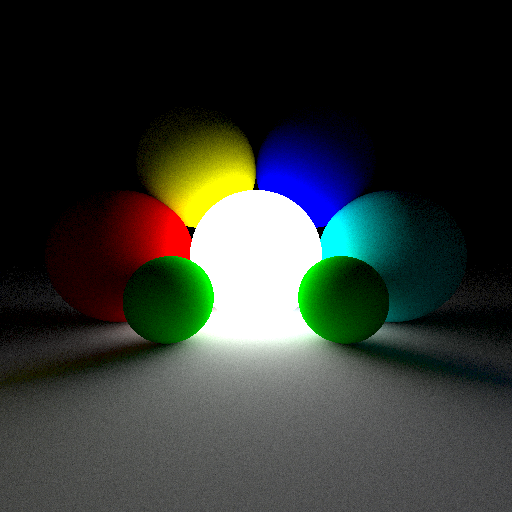

# Example #3: path tracing with loop-break

Let's now consider a more interesting case and finally do some path tracing (fig. 1)! The full source code of this example is located at [apps/01_intersectSphere/](apps/03_spheresStupidPt_loopBreak/).

<p align = "center"></p><p align = "center">Fig. 1. Very basic example of path tracing in Vukan with our RTV tempplate</p><BR>

## if(...) break and if(...) return inside control functions

What happends when rays goes ouf of scene? We first consider simplified version, a slightly modified second example.

The basic version of our code is almost same as in previous example (well, except that we use 1D threading now):

```cpp
void TestClass::CastSingleRay(uint tid, uint* in_pakedXY, uint* out_color)
{
  float4 rayPosAndNear, rayDirAndFar;
  kernel_InitEyeRay(tid, in_pakedXY, 
                    &rayPosAndNear, &rayDirAndFar);

  Lite_Hit hit;
  kernel_RayTrace(tid, &rayPosAndNear, &rayDirAndFar,
                  &hit);

  kernel_GetMaterialColor(tid, &hit, 
                          out_color);
}

```

But what will happend if during ray tracing ray is missed geometry? You can process such case in *kernel_GetMaterialColor* which is absolutely fine. However you probably don't want to pollute the code of *kernel_GetMaterialColor* with such a check and prefer to go another way:

```cpp
void TestClass::CastSingleRay(uint tid, uint* in_pakedXY, uint* out_color)
{
  float4 rayPosAndNear, rayDirAndFar;
  kernel_InitEyeRay(tid, in_pakedXY, 
                    &rayPosAndNear, &rayDirAndFar);

  Lite_Hit hit;
  if(!kernel_RayTrace(tid, &rayPosAndNear, &rayDirAndFar,
                      &hit))
    return;

  kernel_GetMaterialColor(tid, &hit, 
                          out_color);
}

```
 
 Well, now if we imagine this code runing on GPU in several kernels, the return construction actually means that for all threads which execute return statement, **subsequent kernel calls** should immediately exit without executing their logic for these dead threads. The more complex example is classic path tracing loop:
 

```cpp
void TestClass::StupidPathTrace(uint tid, uint a_maxDepth, uint* in_pakedXY, float4* out_color)
{
  float4 accumColor, accumThoroughput;
  kernel_InitAccumData(tid, &accumColor, &accumThoroughput);

  float4 rayPosAndNear, rayDirAndFar;
  kernel_InitEyeRay(tid, in_pakedXY, &rayPosAndNear, &rayDirAndFar);

  for(int depth = 0; depth < a_maxDepth; depth++) 
  {
    Lite_Hit hit;
    if(!kernel_RayTrace(tid, &rayPosAndNear, &rayDirAndFar, &hit))
      break;

    kernel_NextBounce(tid, &hit, 
                      &rayPosAndNear, &rayDirAndFar, &accumColor, &accumThoroughput);
  }

  kernel_ContributeToImage(tid, &accumColor, in_pakedXY, 
                           out_color);
}
```

Here we can see that a sequence of kernells are called in the loop. When a thread breaks the loop, all subsequent executions of both *kernel_RayTrace* and *kernel_NextBounce* should not be executed. But *kernel_ContributeToImage* is still have to be executed after the loop ends for all threads because otherwise we can't add accumulated color to the *out_color* image buffer.

Here we see a quite standart problem for path tracing on the GPU: the less threads we have, less usefull work we actually do. And the problem is not just about performance, but is **also about code quality**, because to make this algorithm work on GPU we have to add specific code to it. And this code is not related to algoritrm itself but it is related to GPU specific optimizations.

In fact there are at least several existing ways to deal with such code: 

1. Add specific thread flags and check them inside each kernel. Surprisingly, this one works better than the rest in most cases;

2. [Path](https://jannovak.info/publications/PathRegPT/index.html) regeneration by adding new work to dead threads;

3. Thread [compaction](http://www.sci.utah.edu/~wald//Publications/2011/PathCompaction/compact.pdf) (full or partial, which is performed for single thread block in shared memory);

4. Using Vulkan RTX pipeline and assume that implementation will manage this problem in some way because it should. 

Now the biggest problem is that all of these ways are quite **(1) different and (2) difficult to implement**  scenarious of the same algorithm.  In most cases, for example, thread flags will be optimal. But if you have large number of iterations (well, usually larger than 50), other options may be useful for performance. But which one? The full thead compactions as were implemented in [Streaming Path Tracing](https://citeseerx.ist.psu.edu/viewdoc/download?doi=10.1.1.217.7304&rep=rep1&type=pdf) may be quite [expencieve](http://www.sci.utah.edu/~wald//Publications/2011/PathCompaction/compact.pdf), because it change access pattern to your payload data and break memory coalescing. More lite and simple way is to perform thread compaction in shared memory for separate thread blocks (and probably use larger thread blocks, for example 512 threads). But this still may lead to significant overhead for lite kernels and thus you should decide which kernels are exposed for this optimization and which of them are not. Using Vulkan RTX may be the best option, but do you always have ray tracing hardware on the customer side? 

What kernel_slicer actually does for you in this case, it is allow you to **focus on the logic implementation** and leave optimizations to translator back-end. You don't have to do all of this piece of oprimization yourself because it is stupid and mechanical work! Just leave you logic in its original form and forget about this quite low-level details!  

**(!!!) WARNING (!!!) Currently we use only thread flags. Other implementations are our FUTURE WORK!**  
Moreover, you can simply try different optimizations transparently by just telling the compiler what optimization it needs to apply. Then you can test performance and decide which of these options is best for your application.
**(!!!) WARNING (!!!) Currently we use only thread flags. Other implementations are our FUTURE WORK(!**  

## std::vector's data access

Now, the second interesting thing about considered example in that we can access data members of main class directly inside kernel. Including std::vector data members. Let us see input:

```cpp
bool TestClass::kernel_RayTrace(uint tid, const float4* rayPosAndNear, float4* rayDirAndFar,
                                Lite_Hit* out_hit)
{
  const float3 rayPos = to_float3(*rayPosAndNear);
  const float3 rayDir = to_float3(*rayDirAndFar );

  Lite_Hit res;
  res.primId = -1;
  res.instId = -1;
  res.geomId = -1;
  res.t      = MAXFLOAT;
  
  for(int sphereId=0;sphereId<spheresPosRadius.size();sphereId++)
  {
    const float2 tNearAndFar = RaySphereHit(rayPos, rayDir, spheresPosRadius[sphereId]);
  
    if(tNearAndFar.x < tNearAndFar.y && tNearAndFar.x > 0.0f && tNearAndFar.x < res.t)
    {
      res.t      = tNearAndFar.x;
      res.primId = sphereId;
    }
  }

  *out_hit = res;
  return (res.primId != -1);
}
```
The spheresPosRadius is std::vector. Here we access vector data and size member as we do normaly in C++ code. When porting this code to GPU you will have to put spheresPosRadius data in some buffer, and also you need to put vector.size() in some place in uniform buffer or push-constant. But do you really need to do this over and over again by hand for each vector? Definitely not! So, here is the generator output:

```cpp
__kernel void kernel_RayTrace(
  __global const float4 * restrict rayPosAndNear,
  __global float4 * restrict rayDirAndFar,
  __global Lite_Hit * restrict out_hit,
  __global uint* restrict kgen_threadFlags,
  __global float4* restrict spheresPosRadius,
  __global uint* restrict kgen_data,
  const uint kgen_iNumElementsX, 
  const uint kgen_iNumElementsY,
  const uint kgen_iNumElementsZ,
  const uint kgen_tFlagsMask)
{
  /////////////////////////////////////////////////////////////////
  const uint tid = get_global_id(0); 
  if(tid >= kgen_iNumElementsX)
    return;
  if((kgen_threadFlags[tid] & kgen_tFlagsMask) != 0) 
    return;
  const uint spheresPosRadius_size = kgen_data[20]; 
  /////////////////////////////////////////////////////////////////

  const float3 rayPos = to_float3(rayPosAndNear[tid]);
  const float3 rayDir = to_float3(rayDirAndFar[tid] );

  Lite_Hit res;
  res.primId = -1;
  res.instId = -1;
  res.geomId = -1;
  res.t      = MAXFLOAT;
  
  for(int sphereId=0;sphereId<spheresPosRadius_size;sphereId++)
  {
    const float2 tNearAndFar = RaySphereHit(rayPos, rayDir, spheresPosRadius[sphereId]);
  
    if(tNearAndFar.x < tNearAndFar.y && tNearAndFar.x > 0.0f && tNearAndFar.x < res.t)
    {
      res.t      = tNearAndFar.x;
      res.primId = sphereId;
    }
  }

  out_hit[tid] = res;
  /////////////////////////////////////////////////////////////////
  {
    const bool exitHappened = (kgen_tFlagsMask & KGEN_FLAG_SET_EXIT_NEGATIVE) != 0 ? !((res.primId != -1)) : ((res.primId != -1));
    if((kgen_tFlagsMask & KGEN_FLAG_DONT_SET_EXIT) == 0 && exitHappened)
    {
      kgen_threadFlags[tid] = ((kgen_tFlagsMask & KGEN_FLAG_BREAK) != 0) ? KGEN_FLAG_BREAK : KGEN_FLAG_RETURN;
    }
  };
  /////////////////////////////////////////////////////////////////

}
```
Here we should note several interesting things:

1. The prolog of the kernels is chaned. Now we check thread flags which is related to inactive threads that may happen on previous loop iteration of the control function;

2. We also read vector size from uniform buffer which is placed at correct offset automaticly by our translator;

3. spheresPosRadius is now pointer data type which is passed to kernel;

4. The return statement is changed quite a lot. 

## Get back to if(...) break and if(...) return discussion to better explain RTV pattern

The last one looks quite complex, but this is due to several possible types of calling a boolean kernel may happen in the control function. For example you may want to call some concrete kernel several times under various conditions. For example you may just call the kernel without if(...) break statements: you don't want to set exit flags in this case; you may want to return from function, or break the loop; you may want to return if kernel succeded (returned true) or if it is not.

In general you don't have to worry about the complexity of generated expresions. Instead you should know what is included inside RTV pattern and what is not. Furher examples are allowed:

```cpp
if(kernel_XXX(...))
  break;
```

```cpp
if(kernel_XXX(...))
  return;
```

```cpp
if(!kernel_XXX(...))
  break;
```

```cpp
if(!kernel_XXX(...))
  return;
```

And further is also normal code because it don't change control flow on GPU:
```cpp
if(someConditionEvaluatedOnCPU()) 
  kernel_XXX(...);
else
  kernel_YYY(...);
```

No other if-expressions **within kernels in condition** are allowed currently! For example further code is not suported:
```cpp
if(kernel_XXX(...) == 2) // INCORRECT FOR CURRENT IMPLEMENTATION !!!
  return;                // INCORRECT FOR CURRENT IMPLEMENTATION !!!
```
In fact **we could push any conditional expression** inside kernel automaticly to support such expressions. However we would like to avoid this for current implementation because when single kernel met with different conditions, we actually have no other way than generate several different kernels, pushing inside each of them different conditions. We will add support for such things in the future. Please let us know if you need them!

## RayMiss shader (!) FUTURE WORK (!)

Now we could guess why in RTX they have so-called "RayMiss" shader. If we consider further code:

```cpp
for(int depth = 0; depth < a_maxDepth; depth++) 
{
  Lite_Hit hit;
  if(!kernel_RayTrace(tid, ... , &hit))
  {
    kernel_RayMiss(tid, ... , &hit); 
    break;
  }

  kernel_NextBounce(tid, ... );
}
```

It could be transformed to more efficient implementation which call kernel_RayMiss only once at the end of the loop:
```cpp
Lite_Hit hit;
for(int depth = 0; depth < a_maxDepth; depth++) 
{
  if(!kernel_RayTrace(tid, ... , &hit))
    break;
  
  kernel_NextBounce(tid, ... );
}

kernel_RayMiss(tid, ... , &hit); // and don't forget to check thread flags inside kernel_RayMiss to be sure the break was performed :)
```

