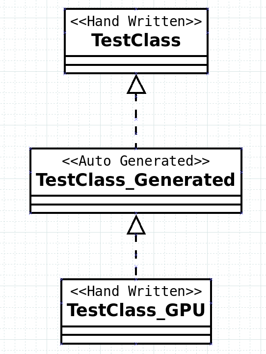

# Using generated class 

<p align = "center"></p>
<p align = "center">Fig. 1. Typical kernel_slicer usage scheme</p><BR>

It is supposed that you will take generated code and bind it to the normal hand-written Vulkan code (fig. 1). However we need to discuss nuances which may be not obvious.

1. kernel_slicer generate shaders in C++ (for circle or clspv) and C++ code in Vulkan to make these shaders work in the way you specify in *Control Function (CF)*;

2. Normally you **don't have to directly edit generated code(!)**. There is only one case when you will need it --- for debug purposes;

3. In other case you should use virtual functions override ro replace parts of generated class you need to change. Thus when you change input CPU code and perform Vulkan code generation again, you will not loose your changes. In general, the algorithm is as follows: you analyze the generated class and understand which functions should be overrided to get desired behaviour. Nevertheless, below we will briefly describe how generated code works and could be linked to hand written.


## Logic of generated class

1. The generated class (*TestClass_Generated*) inherits input class (*TestClass*);

2. You can directly used *TestClass_Generated* if you don't plan to change generated source code. Otherwise we recommend to create the third class (called *TestClass_GPU*) which inherits *TestClass_Generated* (Fig. 2);

<p align = "center"></p>
<p align = "center">Fig. 2. Class hierarchy for generated and hand written code </p><BR>

3. The constructor of generated class is always empty currently. We did so to avoid solving the issue of passing constructor parameters through class hierarchy. So it is supposed that additional initialization functions will be added to *TestClass* or *TestClass_GPU* by yourself (and then called in the apropriate time);

```cpp
class TestClass_GPU : public TestClass_Generated
{
public:

  typedef TestClass_Generated Base;

  TestClass_GPU(){}  
   ~TestClass_GPU(){}
   
  // some definitions ...
  // some overrides ...
};
```

4. Before you understand what exactly you will override and add inside *TestClass_GPU* consider typical usage scenario of generated code. We will here consider it for [Example #3: path tracing with loop-break](README_ex03.md) case. In this sample several Control Functions are used. We speak about "PackXY" and "StupidPathTrace" functions. So, here is the typical scenario:

```cpp
// (1) Init generated class
//
auto pGPUImpl = std::make_shared<TestClass_GPU>();                                   // create 'TestClass_GPU' object
pGPUImpl->InitVulkanObjects(device, physicalDevice, WIN_WIDTH*WIN_HEIGHT, 256, 1, 1, // init vulkan objects, max thread number (WIN_WIDTH*WIN_HEIGHT) and default work group size (256, 1, 1)
                            &packXYConfig, 1);                                       // if some kernels need different work group size, you can set it via exception list here. 
                                                                                     // In our example this is "kernel_PackXY" need different work group size; 
                                                                                     // please don't confuse "kernel_PackXY" with "PackXY".
// (2) other use initializations
//
pGPUImpl->InitSomeUserDataCPU(...);  // user specific code for CPU data in TestClass
pGPUImpl->InitSomeUserDataGPU(...);  // user specific code for GPU data in TestClass_GPU

// (3) call 'InitMemberBuffers' to allocate memory for all vectors which became buffers. 
//     Please note that all vectors should reserve() memory before this call in user fucntions like "InitSomeUserData";
//     i.e. for each vector member we allocate memory based on vector.capacity() number, not vector.size()!
//
pGPUImpl->InitMemberBuffers();    // !!! USING GENERATED CODE !!!

// (4) Set CPU data for your algorithm; you may also fill all vectors on this step.
//
pGPUImpl->DoSomeCalculationsOnCPUToFillMembers();

// (5) call generated function 'UpdateAll' to copy data (which you set/fill on the previous step) 
//     from members and vector members of TestClass to vulkan buffers in TestClass_Generated/TestClass_GPU
//
pGPUImpl->UpdateAll(pCopyHelper); // !!! USING GENERATED CODE !!! 

// (6) Bind in/out buffers to generated code; do this for each Control Function (in this example "PackXY" and "StupidPathTrace")
//
pGPUImpl->SetVulkanInOutFor_PackXY(xyBuffer, 0);              // !!! USING GENERATED CODE !!! 
pGPUImpl->SetVulkanInOutFor_StupidPathTrace(xyBuffer,     0,  // !!! USING GENERATED CODE !!!
                                            colorBuffer2, 0); // !!! USING GENERATED CODE !!!

// (7) Finally for each control functions you can write command buffer which execute generated logic;
//
pGPUImpl->PackXYCmd(commandBuffer, WIN_WIDTH, WIN_HEIGHT, nullptr);                      // !!! USING GENERATED CODE for "PackXY"          : PackXY(WIN_WIDTH,WIN_WIDTH)
pGPUImpl->StupidPathTraceCmd(commandBuffer, WIN_WIDTH*WIN_HEIGHT, 6, nullptr, nullptr);  // !!! USING GENERATED CODE for "StupidPathTrace" : StupidPathTrace(WIN_WIDTH*WIN_HEIGHT, 6)
```

5. Now let us discuss what you are going to add to *TestClass_GPU* class to supplement or replace some logic from *TestClass_Generated*. The code could be divide in two categories:

* **New code** that adds some logic or data members to *TestClass_GPU* and probably use some members from both *TestClass_Generated* and *TestClass*. This is easy case because you just write such code in normal way. For example you can add "InitSomeUserDataGPU" function which will init and setup any type of needed Vulkan objects or data to *TestClass_GPU*. You can certainly add to the *TestClass_GPU* class any number of functions and data you need. You can call them further in any order you want.  

* **Overides** for *TestClass_Generated* functions in *TestClass_GPU*. This case is a bit more complex because it requires understanding of *TestClass_Generated* by the user. However general algorithm is straitforward: First override all functions which are affected by your changes; call orginal versions from *TestClass_Generated* via "Base::SomeFunction(...)"; Second, override additional functions for particular kernel call;


```cpp
// (1) Override all functions which are affected by your changes
//
void TestClass_GPU::SetVulkanInOutFor_PackXY(VkBuffer a_out_pakedXYBuffer, size_t a_out_pakedXYOffset, uint32_t dummyArgument = 0)
{
  Base::SetVulkanInOutFor_PackXY(a_out_pakedXYBuffer, a_out_pakedXYOffset, dummyArgument);
  // implement your logic here
}

void TestClass_GPU::InitMemberBuffers()
{
  Base::InitMemberBuffers();
  // implement your logic here
}

void TestClass_GPU::UpdateAll(std::shared_ptr<vkfw::ICopyEngine> a_pCopyEngine)
{
  Base::UpdateAll(a_pCopyEngine);
  // implement your logic here
}

...

// (2) Second, override additional functions for particular kernel call which will put desired sequence of commands in command buffer;
//
void TestClass_Generated::RayTraceCmd(uint tid, const float4* rayPosAndNear, float4* rayDirAndFar, Lite_Hit* out_hit)
{
  // implement your logic here  
}

```