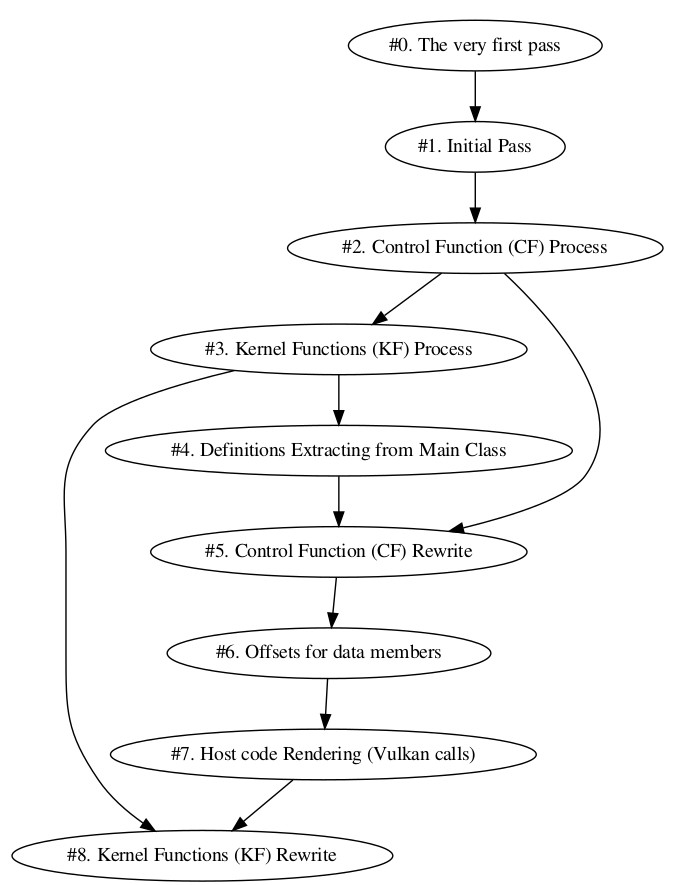
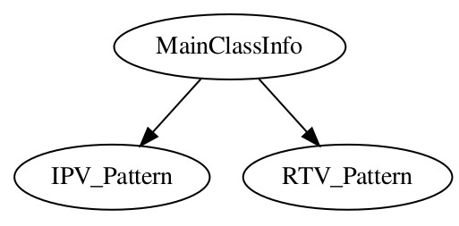

# Internal documentation

## Logic of "main"

Kernel slicer process input source code in several passes. Many passes are single stage and uses recursive AST Visitor or AST matcher depending on what is convinient for current task.  But some passes are 2 stage. This is due to clang AST matchers for some reason don't allow to extract source code and they definitely don't allow to rename it. So if 2-stage pass is happen this is always works in furher way:

1. On the *first  stage* of some pass we process code with AST matchers and their handlers just to find some data and store it in containers (for example, class member variables or functions);

2. On the *second stage* of some pass we run recursive AST visitors to extract source code and/or rename it. 

The bad news is that this is ideal world is different in reality. For example:

*  **pass #2** and **pass #5** represent single pass logic because second pass process **Control Functions** with matchers and the fifth pass rewrite Control Functions. Not sure this can be fixed, just need to remember that in fact some passes are stages of single pass spaced in time

* **pass #3** and **pass #8** represent single pass logic because third pass process **Kernel Functions** with AST matchers and the eighths pass rewrite kernels.

<p align = "center"></p><p align = "center">Fig. 1. passes sequence and dependency </p><BR>

## Passes

0. Pass **\#0: The very first pass.** On the very first pass kernel slicer apply AST matchers to extract kernel and control function **names**. This pass is single stage and uses AST matchers.The control function is a fuction which call kernels:

```
void SomeControlFunction(float* a_data, int a_dataSize)
{
   kernel2D_XXX(...);
   kernel2D_YYY(...);
   kernel2D_ZZZ(a_data, a_dataSize);
}
```

1. Pass **\#1: Initial Pass.** On this pass kernel slicer will find **class-member data** (via resursive AST Visitor called "InitialPassASTConsumer"). This pass is single stage. 

2. Pass **\#2: Control Function (CF) Process.** On this pass kernel slicer will find **local variables of control functions** via AST matchers. Also specific known types of calls like memcpy, memset, std::sort, std::fill and other should be processed on this stahe. This pass is single stage currently, but not at all. It's second stage became **pass #5**. 

3. Pass **\#3: Kernel Functions (KF) Process.** This pass is single-stage and uses AST matchers. On this stage class member variables and vectors that is used inside kernels are marked. Also for IPV pattern internal kernel-loops are detected and their information is extracted. his pass is single stage currently, but not at all. It's second stage became **pass #8**. 

4. Pass **\#4: Definitions Extracting from Main Class.** This pass is two-stage. On the first stage we find all structures, typedefs and constants (contexpr) which is defined inside target class and remember their namnes. On the second pass we extract their source code using recursive AST visitor "DeclExtractor" inside "kslicer::ExtractUsedTC".

5. Pass **\#5: Control Function (CF) Rewrite.** This is actually the second stage of second pass. We perform generation of control function source for GPU on this stage. For RTV pattern kernels are also changed in "AddSpecVars_CF" and "PlugSpecVarsInCalls_CF" to support thread flags and loop break in RTV pattern. 

6. Pass **\#6: Offsets for data members.**  On this pass we place data members in buffer and calc their offsets ("kslicer::MakeClassDataListAndCalcOffsets").  

7. Pass **\#7: Host code Rendering (Vulkan calls).** On this pass we firstly obtain json with all generated host code in "PrepareJsonForAllCPP". Next we perform templated text rendering using "C++ inja" framework.

8. Pass **\#8: Kernel Functions (KF) Rewrite.** On this pass "ProcessCallArs_KF" and "VisitAndRewrite_KF" perform rewrite and "PrintGeneratedCLFile" perform templated text rendering  

## Patterns and Main Source Code Info

We divide these patterns into micro and macro ones. Micro patterns could be used within (or pariculary inside) the macro one. So, the macro patterns define general generator behaviour when processing target class and the micro pattern is some-thing general which could be used inside patterns. For example, vector.push_back is the micro pattern which can be found in both IPV and RTV macro patterns.

### Micro Patterns

1. data compaction via vector.push_back;

2. copying data via memcpy;

3. filling buffer with memset or std::fill; 

4. Generalized NBody is micro pattern because it is applied to single kernel; 

### Macro Patterns 

1. IPV pattern: Parallel for. Loops are defined inside kernels.

2. RTV pattern: Parallel for. Loops are assumed to be outside of control functions.

Class "MainClassInfo" represent generalized abstract interface which may have different implementation for different macro patterns.  

<p align = "center"></p><p align = "center">Fig. 2. Class hierarchy for macro patterns </p><BR>
